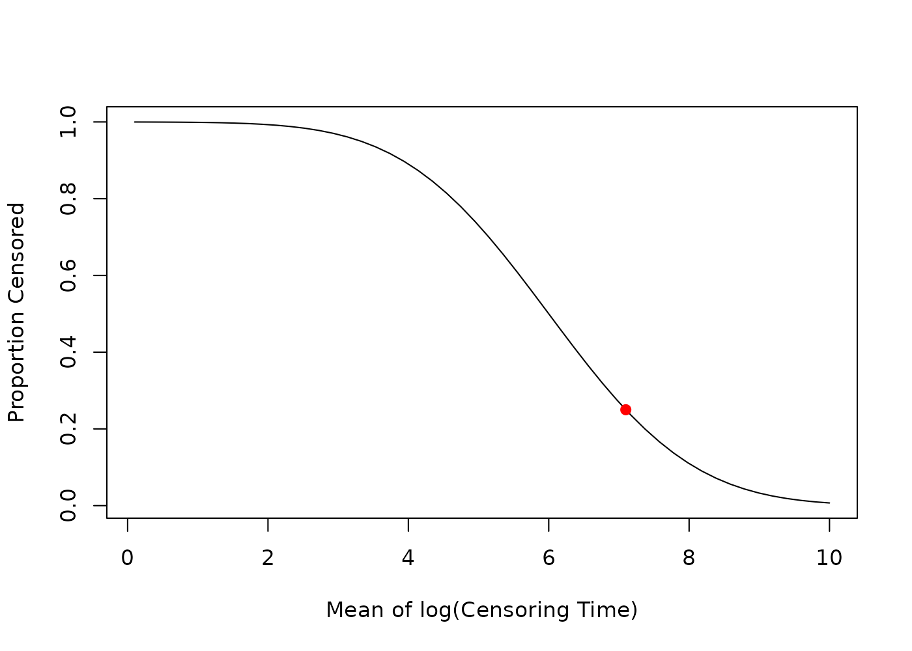
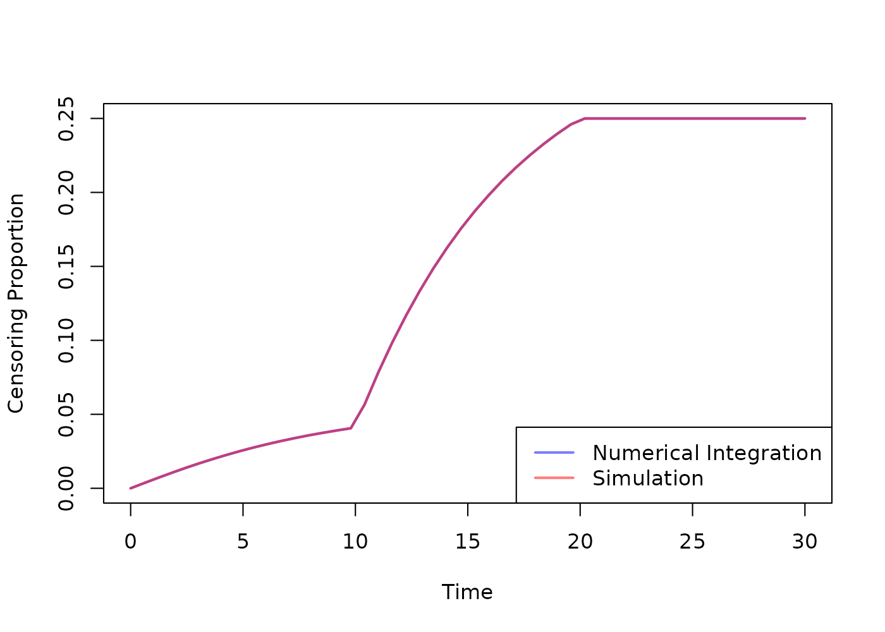

# Examples

This vignette provides examples for common usage of functions in the
[`help(CensRCalc)`](https://iden-project-uas-darmstadt.github.io/CensRCalc/reference/CensRCalc.md)
package.

For each situation we need to define the event time distribution and the
random censoring distribution. When calling the functions, we need to
specify the survival function \\S\_{T^\*\mid\mathbf{X}}\\ of the event
time (conditional on the covariates, if there are any), the survival and
density functions \\S\_{C\mid\lambda\_{C\_{\text{rnd}}}}\\ and
\\f\_{C\mid\lambda\_{C\_{\text{rnd}}}}\\ of the censoring time and, if
applicable, the joint density function \\f\_\mathbf{X}\\ and bounds of
the covariates.

For each example, we want to achieve a expected 25% proportion of
censoring.

``` r

library(CensRCalc)

set.seed(1234)
pc_target <- 0.25
```

## Weibull with Exponential Censoring

The event time follows a Weibull distribution with shape parameter
\\\alpha = 2\\ and scale parameter \\\lambda\_{T^\*} = 10\\, that is \\
T^\*\sim \text{Weibull}(\alpha, \lambda\_{T^\*}). \\

The random censoring time follows an exponential distribution with rate
parameter \\\lambda\_{C\_{rnd}}\\, that is \\ C\_{\text{rnd}}\sim
\text{Exp}(\lambda\_{C\_{rnd}}) \\ leading to \\S\_{C\_{\text{rnd}}}(t)
= \exp(-\lambda\_{C\_{rnd}} t)\\ and \\f\_{C\_{\text{rnd}}}(t) =
\lambda\_{C\_{rnd}} \exp(-\lambda\_{C\_{rnd}} t)\\.

The default of the package is to use exponential censoring, so we only
need to specify the survival function of the event time.

The default bounds for the \\\lambda\_{C\_{rnd}}\\ parameter are c and
10^{-5}.

``` r

lambda_evt <- 0.1
shape <- 2

event_surv <- \(t) 1 - pweibull(t, shape = shape, scale = 1 / lambda_evt)

lambda_c_50 <- find_cens_param(pc_target, event_surv)
lambda_c_50
#> $parameter
#> [1] 0.0338
#> 
#> $cens_prop
#> [1] 0.2500012
```

We can now simulate data.

``` r

n <- 10**6

event_times <- rweibull(n, shape = shape, scale = 1 / lambda_evt)
censoring_times <- rexp(n, rate = lambda_c_50$parameter)

observed_times <- pmin(event_times, censoring_times)
censoring_indicators <- as.integer(event_times <= censoring_times)
mean(censoring_indicators == 0)
#> [1] 0.249808
```

## Weibull with Exponential Censoring and Covariates

The event time follows a Weibull distribution with shape parameter
\\\alpha = 2\\ and scale parameter \\\lambda\_{T^\*} = 10\*\exp(-0.5 \*
x1 + 0.3 \* x2 \* \text{trt} - 0.2 \* \text{trt})\\, that is \\
T^\*\mid\mathbf{X}\sim \text{Weibull}(\alpha, \lambda\_{T^\*}). \\

The random censoring time follows an exponential distribution with rate
parameter \\\lambda\_{C\_{rnd}}\\, that is \\
C\_{\text{rnd}}\sim\text{Exp}(\lambda\_{C\_{rnd}}). \\

We have three covariates: A standard normal covariate
\\X_1\sim\text{N}(0,1)\\, a uniform covariate \\X_2 \sim \text{U}(0,1)\\
and a binary treatment indicator \\\text{trt}\sim\text{B}(0.5)\\.

``` r

lambda_evt <- \(x1, x2, trt) 0.1 * exp((-0.5 * x1 + 0.3 * x2 * trt - 0.2 * trt))
cov_dens <- \(x1, x2, trt) dnorm(x1) * dunif(x2, 0, 1) * dbinom(trt, 1, 0.5)

# Note that we give the bounds for trt as a list,
# because it is a discrete variable.

cov_bounds <- list(
  x1 = c(-Inf, Inf),
  x2 = c(0, 1),
  trt = list(0, 1)
)
shape <- 2

event_surv <- function(t, x1, x2, trt) {
  1 - pweibull(t, shape = shape, scale = 1 / lambda_evt(x1, x2, trt))
}

# This will take a bit longer to compute
lambda_c_50 <- find_cens_param(pc_target, event_surv,
  covariate_density = cov_dens,
  covariate_bounds = cov_bounds
)
lambda_c_50
#> $parameter
#> [1] 0.03049219
#> 
#> $cens_prop
#> [1] 0.25
```

The warnings are caused by the numerical integration where the bounds
\\(-\infty, \infty)\\ of covariate \\X_1\\ are inserted. This does not
affect the result.

We can now simulate data.

``` r

n <- 10**6

cov_data <- data.frame(
  x1 = rnorm(n),
  x2 = runif(n, 0, 1),
  trt = rbinom(n, 1, 0.5)
)
event_times <- rweibull(
  n,
  shape = shape,
  scale = 1 / lambda_evt(
    cov_data$x1,
    cov_data$x2,
    cov_data$trt
  )
)
censoring_times <- rexp(n, rate = lambda_c_50$parameter)

observed_times <- pmin(event_times, censoring_times)
censoring_indicators <- as.integer(event_times <= censoring_times)
mean(censoring_indicators == 0)
#> [1] 0.250179
```

## Lognormal with Lognormal Censoring

We first use
[`CensRCalc::estimate_cens_prop()`](https://iden-project-uas-darmstadt.github.io/CensRCalc/reference/estimate_cens_prop.md)
to see the effect of different censoring parameters on the proportion of
censoring.

We have a lognormal distributed event time with parameters \\\mu\_{T^\*}
= 6\\ and \\\sigma\_{T^\*} = 1.1\\, that is

\\ T^\* \sim \text{LN}(\mu\_{T^\*}, \sigma\_{T^\*}) \leftrightarrow
\ln(T^\*) \sim \text{N}(\mu\_{T^\*}, \sigma\_{T^\*}). \\

Also the random censoring is lognormal distributed with fixed \\\sigma_C
= 1.2\\ and \\\mu_C = \lambda_C\\ is the parameter of interest, that is
\\ C \sim \text{LN}(\lambda_C, \sigma_C). \\

``` r

event_surv <- \(t) 1 - plnorm(t, meanlog = 6, sdlog = 1.1)
cens_sdlog <- 1.2
cens_surv <- \(t, mean) 1 - plnorm(t, meanlog = mean, sdlog = cens_sdlog)
cens_dens <- \(t, mean) dlnorm(t, meanlog = mean, sdlog = cens_sdlog)

bounds <- c(0.1, 10)

est_fun <- estimate_cens_prop(event_surv,
  cens_survival = cens_surv,
  cens_density = cens_dens,
  target_bounds = bounds,
  target = "mean"
)

x <- seq(bounds[1], bounds[2], length.out = 50)
y <- sapply(x, est_fun)
mean_c_50 <- find_cens_param(pc_target, event_surv,
  cens_survival = cens_surv,
  cens_density = cens_dens,
  target = "mean",
  target_bounds = bounds
)

plot(
  x,
  y,
  type = "l",
  xlab = "Mean of log(Censoring Time)",
  ylab = "Proportion Censored"
)
points(mean_c_50$parameter, pc_target, col = "red", pch = 19)
```



We can now simulate data.

``` r

n <- 10**6

event_times <- rlnorm(n, meanlog = 6, sdlog = 1.1)
censoring_times <- rlnorm(n, meanlog = mean_c_50$parameter, sdlog = cens_sdlog)

observed_times <- pmin(event_times, censoring_times)
censoring_indicators <- as.integer(event_times <= censoring_times)
mean(censoring_indicators == 0)
#> [1] 0.250447
```

## Weibull with Exponential Censoring, Covariates, Administrative Censoring and Accrual

As in a previous example, the event time follows a Weibull distribution
with shape parameter \\\alpha = 2\\ and scale parameter
\\\lambda\_{T^\*} = 10\*\exp(-0.5 \* x1 + 0.3 \* x2 \* \text{trt} - 0.2
\* \text{trt})\\, that is \\ T^\*\mid\mathbf{X}\sim
\text{Weibull}(\alpha, \lambda\_{T^\*}). \\

The random censoring time follows an exponential distribution with rate
parameter \\\lambda\_{C\_{rnd}}\\, that is \\ C\_{\text{rnd}}\sim
\text{Exp}(\lambda\_{C\_{rnd}}) \\ leading to \\S\_{C\_{\text{rnd}}}(t)
= \exp(-\lambda\_{C\_{rnd}} t)\\ and \\f\_{C\_{\text{rnd}}}(t) =
\lambda\_{C\_{rnd}} \exp(-\lambda\_{C\_{rnd}} t)\\.

We have three covariates: A standard normal covariate \\X_1\sim\text
{N}(0,1)\\, a uniform covariate \\X_2 \sim \text{U}(0,1)\\ and a binary
treatment indicator \\\text{trt}\sim\text{B}(0.5)\\.

In addition, we have an accrual time of \\\tau\_{\text{acc}} = 1\\ and
an administrative censoring time of \\\tau\_{\text{adm}} = 3\\, inducing
the random administrative censoring variable \\ C\_{\text{adm}}\sim
\text{U}(2,3) \\ with \\S\_{C\_{\text{adm}}}(t) = 3-t\\ and
\\f\_{C\_{\text{adm}}}(t) = 1\\.

``` r

lambda_evt <- \(x1, x2, trt) 0.1 * exp((-0.5 * x1 + 0.3 * x2 * trt - 0.2 * trt))
cov_dens <- \(x1, x2, trt) dnorm(x1) * dunif(x2, 0, 1) * dbinom(trt, 1, 0.5)

# Note that we give the bounds for trt as a list,
# because it is a discrete variable.

cov_bounds <- list(
  x1 = c(-Inf, Inf),
  x2 = c(0, 1),
  trt = list(0, 1)
)
shape <- 2

event_surv <- function(t, x1, x2, trt) {
  1 - pweibull(t, shape = shape, scale = 1 / lambda_evt(x1, x2, trt))
}

time_acc <- 10
time_adm <- 20

lambda_c_50 <- find_cens_param(pc_target, event_surv,
  covariate_density = cov_dens,
  covariate_bounds = cov_bounds,
  time_admin_cens = time_adm,
  time_accrual = time_acc
)
lambda_c_50
#> $parameter
#> [1] 0.005809193
#> 
#> $cens_prop
#> [1] 0.2499994
```

The warnings are caused by the numerical integration where the bounds
\\(-\infty, \infty)\\ of covariate \\X_1\\ are inserted. This does not
affect the result.

We can now simulate data.

``` r

n <- 10**6

cov_data <- data.frame(
  x1 = rnorm(n),
  x2 = runif(n, 0, 1),
  trt = rbinom(n, 1, 0.5)
)
event_times <- rweibull(
  n,
  shape = shape,
  scale = 1 / lambda_evt(
    cov_data$x1,
    cov_data$x2,
    cov_data$trt
  )
)
rnd_censoring_times <- rexp(n, rate = lambda_c_50$parameter)
adm_censoring_times <- runif(n, time_adm - time_acc, time_adm)

censoring_times <- pmin(rnd_censoring_times, adm_censoring_times)
observed_times <- pmin(event_times, censoring_times)
censoring_indicators <- as.integer(event_times <= censoring_times)
mean(censoring_indicators == 0)
#> [1] 0.249912
```

Instead of the overall censoring proportion \\P(C \< T^\*)\\, we can
also evaluate the censoring proportion at a specific time point \\\tau\\
\\P(C \< \tau \mid T^\* \> \tau)=1-S\_{C\_{\text{obs}}}(t)\\.

``` r

taus <- seq(0, 30, length.out = 50)

estimator <- estimate_cens_prop(event_surv,
  covariate_density = cov_dens,
  covariate_bounds = cov_bounds,
  time_admin_cens = time_adm,
  time_accrual = time_acc
)

cens_p_num <- sapply(taus, \(tau) estimator(lambda_c_50$parameter, tau = tau))

# Based on the simulated data:
cens_p_sim <- sapply(taus, \(tau) {
  mean(censoring_indicators == 0 & observed_times <= tau)
})

plot(taus, cens_p_num,
  type = "l", col = rgb(0, 0, 1, 0.5), lwd = 2,
  xlab = "Time", ylab = "Censoring Proportion"
)
lines(taus, cens_p_sim, col = rgb(1, 0, 0, 0.5), lwd = 2)
legend("bottomright",
  legend = c("Numerical Integration", "Simulation"),
  col = c(rgb(0, 0, 1, 0.5), rgb(1, 0, 0, 0.5)), lwd = 2
)
```


